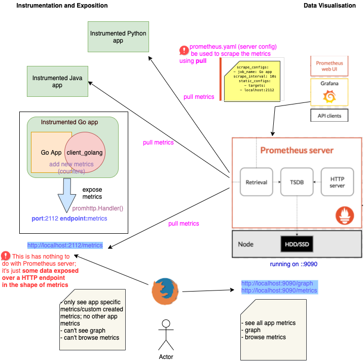

## instrumenting-go-app-with-prom

This ia a very simple Go app which determines whether the numbers are odd or even, from a list of 1 to 100 numbers.

[client_golang](https://github.com/prometheus/client_golang) is used to instrument the app. Two counters have been added to monitor odd and even checks. 

### How to integrate this metrics with a Prometheus server?

